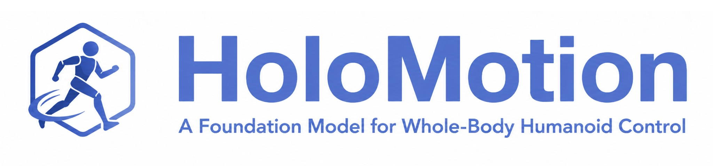
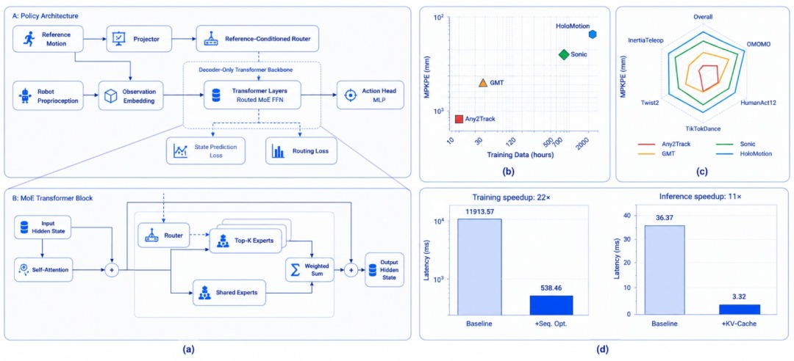
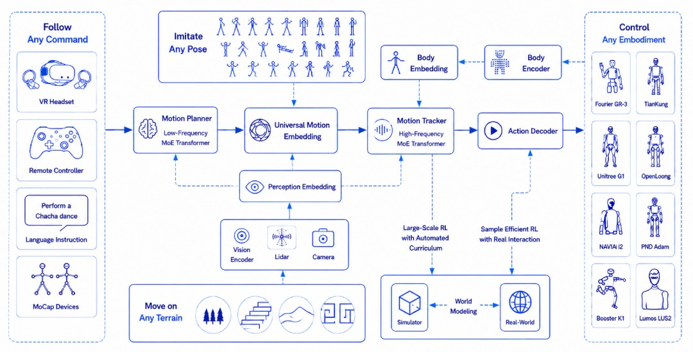
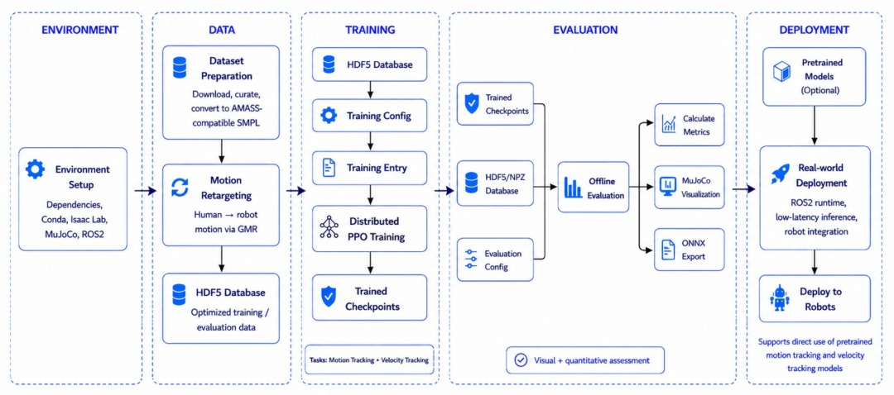

<div align="center">



[](https://horizonrobotics.github.io/robot_lab/holomotion/)
[](https://huggingface.co/collections/HorizonRobotics/holomotion)
[](https://deepwiki.com/HorizonRobotics/HoloMotion)
[](https://horizonrobotics.feishu.cn/docx/Xs3cdEI8bo1EZuxUfzjckTgKn2c)
[](https://arxiv.org/abs/2605.15336)


</div>

# News
- [2026.05.15] HoloMotion v1.3 scales from 60M to 0.4B parameters and 80 to 2000+ hours of motion data, while improving policy inference from ~100 to ~300 FPS.
- [2026.04.04] HoloMotion v1.2 provides pre-trained motion tracking and velocity tracking models for the community to deploy directly.


# Why HoloMotion?

## Larger, Faster and Stronger

HoloMotion scales humanoid whole-body control through a reference-conditioned MoE Transformer, large-scale motion data, and an optimized training-to-deployment pipeline, delivering stronger motion tracking with real-time inference efficiency.

<p align="center">
  
</p>


## Scales Toward 4-Any Humanoid Control

The roadmap of HoloMotion advances through four generalization targets, from motion imitation to command following, terrain adaptation, and embodiment transfer.

<p align="center">
  
</p>

| Version  | Target Capability | Status      | Description                                                                                                                         |
| -------- | ----------------- | ----------- | ----------------------------------------------------------------------------------------------------------------------------------- |
| **v1.x** | Any Pose          | ✅ Done        | Achieve robust tracking and imitation of diverse, whole-body human motions, forming the core of the imitation learning capability.  |
| **v2.x** | Any Command       | 🚀 Next        | Enable language- and task-conditioned motion generation, allowing for goal-directed and interactive behaviors.                      |
| **v3.x** | Any Terrain       | 🧭 Planned    | Master adaptation to uneven, dynamic, and complex terrains, enhancing real-world operational robustness.                            |
| **v4.x** | Any Embodiment    | 🧭 Planned    | Generalize control policies across humanoids with varying morphologies and kinematics, achieving true embodiment-level abstraction. |


## Closes the Loop From Data to Robots

HoloMotion provides a clear, modular framework for bridging motion data, policy learning, simulation evaluation, and real-robot deployment.

<p align="center">
  
</p>

## No Per-User Training Required

Whether you want to replay motions, stream live teleoperation, or train a custom policy, HoloMotion provides a direct path into the workflow:

| User Goal | Start Here | What You Need |
| --------- | ---------- | ------------- |
| **Offline motion tracking**<br/>Replay local motion clips for demos such as dance or scripted performances. | [Real-world deployment: Offline Motion](docs/realworld_deployment.md#offline-motion) | A pretrained policy and retargeted `.npz` motion clips. No model training is required. |
| **Online motion tracking**<br/>Follow live VR or teleoperation motion streams. | [Real-world deployment: Online Motion](docs/realworld_deployment.md#online-motion) | A pretrained policy, robot deployment setup, and a live motion source. No model training is required. |
| **Train your own model**<br/>Build a custom policy from your own motion data. | [Environment setup](docs/environment_setup.md) → [Data curation](docs/smpl_data_curation.md) → [Retargeting](docs/motion_retargeting.md) → [Training](docs/train_motion_tracking.md) → [Evaluation](docs/evaluate_motion_tracking.md) | Training environment, curated motion data, retargeted HDF5 datasets, and GPU resources. |

# Join Us

We are hiring full-time engineers, new graduates, and interns who are excited about humanoid robots, motion control, and embodied intelligence.
Send your resume by scanning the **WeChat** QR code below to get in touch with us.

<p align="center">
  
</p>

# Projects Using HoloMotion

We are glad to see HoloMotion being used as a motion control foundation for humanoid research and applications.

| Project | Description | Links |
| --- | --- | --- |
| OMG: Omni-Modal Motion Generation for Generalist Humanoid Control | Uses HoloMotion as the motion control foundation for omni-modal motion generation and generalist humanoid control. | [Paper](https://arxiv.org/abs/2606.10340) / [Project](https://tsinghua-mars-lab.github.io/OMG/) |

If your project uses HoloMotion, feel free to open a PR to add it here.

# Citation

```
@misc{chen2026holomotion1,
  title = {HoloMotion-1 Technical Report},
  author = {Maiyue Chen and Kaihui Wang and Bo Zhang and Xihan Ma and Zhiyuan Yang and Yi Ren and Qijun Huang and Zihao Zhu and Yucheng Wang and Zhizhong Su},
  year = {2026},
  eprint = {2605.15336},
  archivePrefix = {arXiv},
  primaryClass = {cs.RO},
  url = {https://arxiv.org/abs/2605.15336}
}
```

# Acknowledgements

This project is built upon and inspired by several outstanding open source projects:

- [ASAP](https://github.com/LeCAR-Lab/ASAP)
- [BeyondMimic](https://github.com/HybridRobotics/whole_body_tracking)
- [GMR](https://github.com/YanjieZe/GMR)
- [GVHMR](https://github.com/zju3dv/GVHMR)
- [Humanoidverse](https://github.com/LeCAR-Lab/HumanoidVerse)
- [Mink](https://github.com/kevinzakka/mink)
- [MotionMillion](https://github.com/VankouF/MotionMillion-Codes)
- [PBHC](https://github.com/TeleHuman/PBHC)
- [PHC](https://github.com/ZhengyiLuo/PHC?tab=readme-ov-file)
- [ProtoMotion](https://github.com/NVlabs/ProtoMotions/tree/main/protomotions)
- [SONIC](https://github.com/NVlabs/GR00T-WholeBodyControl)
