<div align="center">


---

[](https://horizonrobotics.github.io/robot_lab/holomotion/)
[](#)
[](#)
[](./LICENSE)
[](https://arxiv.org/abs/2025.00000)

</div>

## Pipeline Overview

```mermaid
flowchart LR
    A["🔧 1. Environment Setup<br/>Dependencies & conda"]

    subgraph dataFrame ["DATA"]
        B["📊 2. Dataset Preparation<br/>Download & curate"]
        C["🔄 3. Motion Retargeting<br/>Human to robot motion"]
        B --> C
    end

    subgraph modelFrame ["TRAIN & EVAL"]
        D["🧠 4. Model Training<br/>Train with HoloMotion"]
        E["📈 5. Evaluation<br/>Test & export"]
        D --> E
    end

    F["🚀 6. Deployment<br/>Deploy to robots"]

    A --> dataFrame
    dataFrame --> modelFrame
    modelFrame --> F

    classDef subgraphStyle fill:#f9f9f9,stroke:#333,stroke-width:2px,stroke-dasharray:5 5,rx:10,ry:10,font-size:16px,font-weight:bold
    classDef nodeStyle fill:#e1f5fe,stroke:#0277bd,stroke-width:2px,rx:10,ry:10
    
    class dataFrame,modelFrame subgraphStyle
    class A,B,C,D,E,F nodeStyle
```



## Quick Start

### 🔧 1. Environment Setup [[Doc](docs/environment_setup.md)]

Follow the instructions in the documentation to create two conda environments:

- `holomotion_train`: For training and evaluation.
- `holomotion_deploy`: For ROS2 deployment in real-world scenarios.

If you only intend to use our pretrained models, you can skip the training environment setup and proceed directly to configure the deployment environment. See the [real-world deployment documentation](docs/realworld_deployment.md) for details.

### 📊 2. Dataset Preparation [[Doc](docs/smpl_data_curation.md)]

Download motion capture datasets and convert them into AMASS-compatible format. Our repository includes preliminary data filtering capabilities to remove abnormal data based on kinematic metrics.

### 🔄 3. Motion Retargeting [[Doc](docs/motion_retargeting.md)]

Convert AMASS-compatible SMPL data into robot-specific motion sequences. Our pipeline currently supports **[PHC](https://github.com/ZhengyiLuo/PHC?tab=readme-ov-file)** and **[Mink](https://github.com/kevinzakka/mink)** retargeting methods, with additional methods planned for future releases.

### 🧠 4. Model Training [[Doc](docs/train_motion_tracking.md)]

Package the retargeted motion data into a training-friendly LMDB database and initiate distributed training across multiple GPUs. We support multiple training paradigms including:

- **PPO**: Pure reinforcement learning
- **AMP**: Adversarial motion prior training
- **DAgger** (optionally with PPO): Teacher-student distillation training

### 📈 5. Evaluation [[Doc](docs/evaluate_motion_tracking.md)]

Visualize and evaluate model performance using widely adopted metrics, then export validated models for deployment. For detailed metric definitions, please refer to the [evaluation documentation](docs/evaluate_motion_tracking.md#evaluation-results).

### 🚀 6. Real-world Deployment [[Doc](docs/realworld_deployment.md)]

Deploy the exported ONNX model using our ROS2 package to run on real-world robots.

## Citation

```
@software{holomotion_2025,
  author = {Maiyue,Kaihui,Bo,Yi,Zihao,Yucheng,Zhizhong},
  title = {{HoloMotion}},
  year = {2025},
  month = july,
  version = {0.2.2},
  url = {https://github.com/},
  license = {Apache-2.0}
}
```

## License

This project is released under the **[Apache 2.0](https://img.shields.io/badge/license-Apache--2.0-blue.svg)** license.

## Acknowledgements

This project is built upon and inspired by several outstanding open source projects:

- [ASAP](https://github.com/LeCAR-Lab/ASAP)
- [Humanoidverse](https://github.com/LeCAR-Lab/HumanoidVerse)
- [PHC](https://github.com/ZhengyiLuo/PHC?tab=readme-ov-file)
- [ProtoMotion](https://github.com/NVlabs/ProtoMotions/tree/main/protomotions)
- [Mink](https://github.com/kevinzakka/mink)
- [PBHC](https://github.com/TeleHuman/PBHC)
