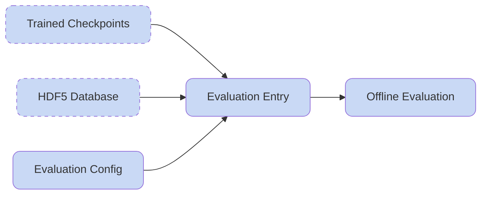

## Evaluate the Motion Tracking Model

After training for a while and saving model checkpoints, it is necessary to run the evaluation process to get to know your model performance both visually and quantitatively. HoloMotion also bakes the model exporting process for later deployment in the evaluation pipeline.

**Overall Workflow:**



### Visually Inspect the Policy

Modify the evaluation entry script to set the `checkpoint_path` and the `eval_h5_dataset_path`. Notice that for correctly bring up the GUI, you should always use `export CUDA_VISIBLE_DEVICES="0"`.

```bash
bash holomotion/scripts/evaluation/eval_motion_tracking.sh
```

### Export Trained Model to ONNX

To deploy our policy to real world robots, we need to convert the pytorch module into ONNX format, which is supported by most inference frameworks.

After running the evaluation script, the `.onnx` file will be generated and saved to the checkpoint directory:

```
logs/HoloMotion/your_checkpoint_dir/
├── config.yaml
├── exported
│   └── model_10000.onnx
└── model_10000.pt
```
