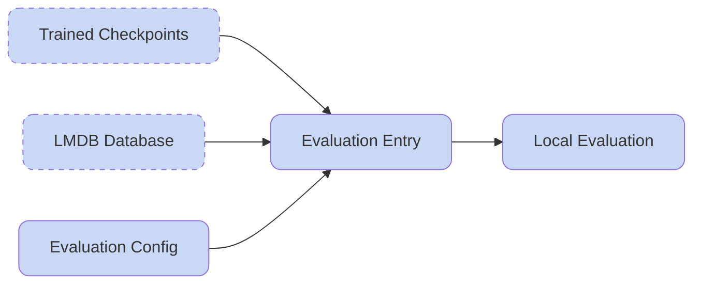

## Evaluate the Motion Tracking Model

After training for a while and saving model checkpoints, it is necessary to run the evaluation process to get to know your model performance both visually and quantitatively. HoloMotion also bakes the model exporting process for later deployment in the evaluation pipeline.

**Overall Workflow:**



### Visually Inspect the Policy

Similar to the training process, the evaluation process is also assembled by defining modules through the evaluation configuration file located in `holomotion/config/evaluation/eval_isaacgym.yaml`. An example config for visual evaluation is like:

```yaml
# @package _global_

defaults:
  - /env/domain_randomization: NO_domain_rand
  - /env/terrain: plane
  - _self_

project_name: HoloMotion_Eval
experiment_name: eval_unitree_g1_21dof_isaacgym

# Evaluation specific settings
num_envs: 1 # Single environment for evaluation
headless: false
use_accelerate: true

# Export settings
export_policy: true # Whether to export policy to ONNX
# noise settings
obs:
  noise_scales:
    base_rpy: 0.0
    base_height: 0.0
    projected_gravity: 0.0
    rel_base_lin_vel: 0.0
    rel_base_ang_vel: 0.0
    base_ang_vel: 0.0
    dof_pos: 0.0
    dof_vel: 0.0
    actions: 0.0
    local_body_pos_flat: 0.0
    local_body_rot_quat_flat: 0.0
    local_body_vel_flat: 0.0
    local_body_ang_vel_flat: 0.0
    limb_weight_params: 0.0
    dif_local_rigid_body_pos_flat: 0.0
    dif_local_rigid_body_rot_flat: 0.0
    dif_local_rigid_body_vel_flat: 0.0
    dif_local_rigid_body_ang_vel_flat: 0.0
    local_ref_rigid_body_pos_flat: 0.0
    local_ref_rigid_body_rot_flat: 0.0
    history_actor: 0.0
    history_critic: 0.0
    amp_agent_seq: 0.0
    local_key_pos: 0.0
    domain_params: 0.0
    rel_bodylink_pos_flat: 0.0
    rel_bodylink_vel_flat: 0.0
    rel_bodylink_ang_vel_flat: 0.0
    rel_bodylink_rot_tannorm_flat: 0.0
    rel_fut_ref_motion_state_flat: 0.0
    mogen_dof_pos: 0.0

env:
  config:
    termination:
      terminate_by_contact: False

      terminate_by_gravity: False
      terminate_by_low_height: False

      terminate_when_motion_end: True
      terminate_when_motion_far: False
      terminate_when_motion_far_patience_steps: 1

      terminate_when_joint_far: False
      terminate_when_joint_far_patience_steps: 1

      terminate_when_close_to_dof_pos_limit: False
      terminate_when_close_to_dof_vel_limit: False
      terminate_when_close_to_torque_limit: False

    noise_to_initial_level: 0
    init_noise_scale:
      dof_pos: 0.0
      dof_vel: 0.0
      root_pos: 0.0
      root_rot: 0 # degree, * 3.14 / 180
      root_vel: 0.0
      root_ang_vel: 0.0
robot:
  control:
    action_scale: 0.25
    action_clip_value: 100.0
    clip_torques: True
# Required checkpoint path (must be provided via command line)
checkpoint: ???
```

Then, modify the evaluation entry script to set the `checkpoint_path` and the `lmdb_path`. Notice that for correctly bring up the GUI, you should always use `export CUDA_VISIBLE_DEVICES="0"`:

```bash
#!/bin/bash
source train.env
export CUDA_VISIBLE_DEVICES="0"

# Fix for RTX 4000 series GPU P2P communication issue
export NCCL_P2P_DISABLE="1"
export NCCL_IB_DISABLE="1"

# Configuration
checkpoint_path="your_exp_dir/model_10000.pt" # REQUIRED: Set this to your checkpoint path
lmdb_path="your_lmdb_databse_dir"
num_envs=4

# Run evaluation with accelerate launch (similar to training)
${Train_CONDA_PREFIX}/bin/accelerate launch \
    holomotion/src/evaluation/eval_motion_tracking.py \
    use_accelerate=true \
    num_envs=${num_envs} \
    headless=false \
    export_policy=true \
    env.config.termination.terminate_when_motion_far=False \
    +robot.motion.motion_file="${lmdb_path}" \
    checkpoint="${checkpoint_path}"
```

Finally, run the evaluation script with on the Linux desktop environment with GUI support. Remote desktop solutions such as xRDP is also supported:

```shell
bash holomotion/scripts/evaluation/eval_motion_tracking_isaacgym.sh
```

### Evaluation Results

After running the evaluation script, the results will be automatically saved in a structured format:

```
your_exp_dir/eval_logs/ckpt_{iteration}/eval_holomotion_metrics_iter-{iteration}/global_metrics.json
```

The `global_metrics.json` file contains comprehensive performance metrics:

| Metric                 | Unit      | Description                                         |
| ---------------------- | --------- | --------------------------------------------------- |
| mpjpe_g                | mm        | Global mean per-joint position error                |
| mpjpe_l                | mm        | Root-relative (local) mean per-joint position error |
| mpjpe_pa               | mm        | Procrustes-aligned mean per-joint position error    |
| vel_dist               | mm/frame  | Average joint velocity error                        |
| accel_dist             | mm/frame² | Average joint acceleration error                    |
| upper_body_joints_dist | rad       | Upper body joint position accuracy                  |
| lower_body_joints_dist | rad       | Lower body joint position accuracy                  |
| root_r_error           | rad       | Torso roll orientation error                        |
| root_p_error           | rad       | Torso pitch orientation error                       |
| root_y_error           | rad       | Torso yaw orientation error                         |
| root_vel_error         | m/frame   | Torso velocity tracking error                       |
| root_height_error      | m         | Torso height maintenance accuracy                   |

### Export Trained Model to ONNX

To deploy our policy to real world robots, we need to convert the pytorch module into ONNX format, which is supported by most inference frameworks.

In order to export the policy, you can simply set the `export_policy=true` in the `eval_motion_tracking_isaacgym.sh` script. After running the evaluation script, the onnx file will be generated and saved to the checkpoint directory:

```
logs/HoloMotion/your_checkpoint_dir/
├── config.yaml
├── exported
│   └── model_10000.onnx
└── model_10000.pt
```

### Export Motion Clips for Deployment

Another ingrdient for deployment is the motion clip data. To obtain the motion clips to imitate during deployment, you can modify the script at `holomotion/scritps/misc/export_single_motion.sh`. This script will read from the lmdb database, and export them as single pkls. Key options:

- `lmdb_path`: The lmdb database directory to extract motion clips from.
- `dump_dir`: Where to dump the exported motion pkls.
- `motion_keys="[key1, key2]": Specify which motion clips to extract, leave the bracket to be empty to export all motions.

Run the export process by:

```shell
bash holomotion/scripts/misc/export_single_motion.sh
```
