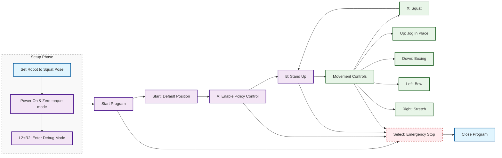
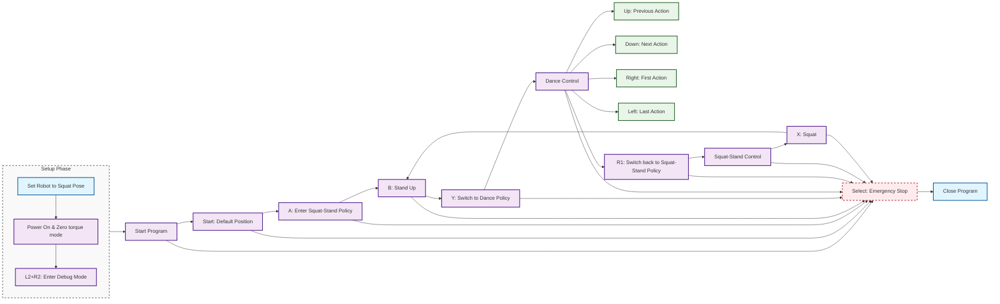

# HoloMotion Deployment Guide

This guide describes how to set up the deployment environment and run the trained policy on a physical Unitree G1 robot.


## Robot Configuration for 21 DOF

The 21 DOF configuration includes:
- 12 leg joints (6 per leg)
- 1 waist joint (yaw) 
- 8 arm joints (4 per arm)

### Model Configuration for 21 DOF

**Important**: Pre-trained model files are not included in this repository. For 21 DOF deployment:

- Place the ONNX model file in `unitree_g1_ros2/src/models/`
- Update the `policy_path` parameter in `unitree_g1_ros2/src/config/g1_21dof_holomotion.yaml`

> **Note**: The model file should be compatible with the 21 DOF configuration and trained using the HoloMotion framework.

---

### Quick Environment Setup

#### Prerequisites

Ensure the following are installed before proceeding:

* Anaconda or Miniconda
* ROS 2 Humble installed at `/opt/ros/humble`
* MCAP for efficient ROS 2 data recording
* Unitree ROS 2 SDK installed at `~/unitree_ros2/`


#### One-Click Deployment

```bash
cd holomotion/deployment
chmod +x deploy_environment.sh
./deploy_environment.sh
```

This script will:

* Create a new conda environment (with CUDA support if available)
* Install Python packages from `requirements/requirements_deploy.txt`
* Install Unitree SDK Python bindings
* Build the ROS 2 workspace under `unitree_g1_ros2/`

---

## Deploy on Physical G1 Robot

### ⚠️ Important Safety Notice

> **For safety reasons, it is strongly recommended to remove the dexterous hands before running the policy.**


### Setup Overview

The deployment process consists of two types of steps:

| **One-Time Setup** (per computer) | **Every Run** (each time you use the robot) |
|-----------------------------------|----------------------------------------------|
| Step 1: Network Configuration    | Step 3: Power On & Initialize Robot         |
| Step 2: Launch Script Setup      | Step 4: Launch Policy Controller            |

> **Note**: Once you complete Steps 1-2, you only need to do Steps 3-4 for each robot session!

### Step 1: Connect and Configure Network

> **Important**: This step only needs to be done **ONCE per computer**. Once configured, your network settings will be saved for future use.

#### Prerequisites for Network Setup:
1. **Power on the robot** and wait for it to fully boot
2. **Use an Ethernet cable** to connect your PC to the robot's LAN port
3. **Ensure both devices are powered on** during configuration

#### Network Configuration:

Configure your PC's network interface with the following static IP settings:

* **Static IP**: `192.168.123.222`
* **Netmask**: `255.255.255.0`
* **Gateway**: (leave empty)

#### Automatic Configuration Script:

You can use the following script to configure it automatically (use command `nmcli con show` to check your actual connection name):

<details>
<summary>Click to view set_static_ip.sh</summary>

```bash
#!/bin/bash

# Replace with your actual connection name (use `nmcli con show` to check)
CON_NAME="Wired connection 1"
IP_ADDRESS="192.168.123.222"
NETMASK="24"
GATEWAY=""

nmcli con modify "$CON_NAME" ipv4.addresses "$IP_ADDRESS/$NETMASK"
nmcli con modify "$CON_NAME" ipv4.method manual

if [ -n "$GATEWAY" ]; then
  nmcli con modify "$CON_NAME" ipv4.gateway "$GATEWAY"
fi

nmcli con modify "$CON_NAME" ipv4.dns ""
nmcli con down "$CON_NAME" && nmcli con up "$CON_NAME"
```

</details>

---

### Step 2: Prepare Launch Script

> **Important**: This configuration also only needs to be done **ONCE per computer**. The settings will be saved for future runs.

#### Configure Network Interface:

1. **Check your network interface name** (while connected to the robot):
   ```bash
   ifconfig
   ```
   Look for the interface connected to the robot (e.g., `enxf8e43ba00afd`, `eth0`, `enp0s31f6`)

2. **Update the launch configuration**:
   ```bash
   # Edit the launch file
   nano unitree_g1_ros2/src/launch/holomotion.launch.py
   ```
   Find and update the `network_interface` parameter with your actual interface name.

#### Configure Environment Path:

3. **Verify conda environment path** in the launch script:
   ```bash
   # Edit the launch script
   nano unitree_g1_ros2/launch_holomotion.sh
   ```
   Make sure the `CONDA_PREFIX` matches your conda environment path (default: `holomotion_deploy`).

4. **Verify Python Environment Configuration**: Check that the `policy_node.py` uses the correct Python interpreter path:

   ```bash
   # Navigate to the policy node directory
   cd unitree_g1_ros2/src/humanoid_policy/

   # Check the current shebang line
   head -1 policy_node.py
   ```

   The first line should point to your `holomotion_deploy` environment:
   ```bash
   #!/your_dir/miniconda3/envs/holomotion_deploy/bin/python
   ```

> **Tip**: After this one-time setup, you can simply run the system without repeating these configuration steps.

---

### Step 3: Power On and Initialize the Robot

> **Do this every time** you want to run the robot.

#### Robot Initialization Sequence:

1. **Power on the robot** - Start the robot in the squatting position
2. **Wait for zero torque mode** - The robot will automatically enter zero torque mode (joints feel loose)
3. **Connect your computer** - Use the same Ethernet cable to connect to the robot's LAN port
4. **Enter debugging mode** - On the remote controller, press `L2 + R2` simultaneously

> **Ready indicator**: When the robot is in debugging mode, the joints should feel free to move (damped state).

---

### Step 4: Launch the Policy Controller

> **Do this every time** to start controlling the robot.

#### Launch the Control System:

```bash
cd holomotion/deployment/unitree_g1_ros2
bash launch_holomotion.sh
```

> **Success indicator**: On startup, the robot joints should remain in zero torque state and feel free to move.

#### Move to Default Pose

While the robot is in zero torque mode, press the **Start** button on the remote controller.
The robot will smoothly move to its **default joint position**.
This step ensures that the robot starts from a consistent and safe posture before executing any motions.

#### Motion Control Mode

After moving to the default pose, press **A** on the controller to enter motion control mode.
In this mode, the trained policy will take over and generate actions for the robot.
You can then use the controller to trigger different predefined behaviors.

The following mapping summarizes the available actions:


| Button | Action               |
| ------ | -------------------- |
| A      | Enable policy control |
| B      | Stand up             |
| X      | Squat                |
| Up     | Jog in place         |
| Down   | Boxing               |
| Left   | Bow                  |
| Right  | Stretch              |
| Select | Emergency Stop |


The robot only responds to button presses in the correct sequence shown in the flowchart. 
Ignoring the order may result in no response, which is expected.

Here is the robot control flowchart:



---

## Robot Configuration for 23 DOF

The 23DOF configuration includes:
- 12 leg joints (6 per leg)
- 3 waist joints (yaw, roll, pitch) - **unlocked and controlled**
- 8 arm joints (4 per arm)

### Model Configuration for 23 DOF

**Important**: Pre-trained model files are not included in this repository. For 23 DOF deployment with dual-policy support:

- Place the squat-stand ONNX model in `unitree_g1_ros2_23dof/src/models/` and update `new_policy_path`
- Place the dance motion ONNX model in `unitree_g1_ros2_23dof/src/models/` and update `policy_path`
- Configure both model paths in `unitree_g1_ros2_23dof/src/config/holomotion_23dof.yaml`

> **Note**: The model files should be compatible with the 23 DOF configuration and trained using the HoloMotion framework.

To upgrade your G1 robot from the standard 21DOF to 23DOF configuration, for detailed instructions, see the [Unitree G1 Developer FAQ](https://support.unitree.com/home/en/G1_developer/FAQ) section on "G1-29 DOF device, after unlocking the waist fixator (APP synchronously closes the waist lock switch), report the joint out-of-limit position error"


---
### Deploy on G1 Robot with 23 DOF

Steps 1–3 can follow the 21 DOF setup; update the corresponding files under `holomotion/deployment/unitree_g1_ros2_23dof` accordingly.

### Step 4: Launch the Policy Controller

```bash
cd holomotion/deployment/unitree_g1_ros2_23dof
bash launch_holomotion_23dof.sh
```

> **Success indicator**: On startup, the robot joints should remain in zero torque state and feel free to move.

#### Move to Default Pose

While the robot is in zero torque mode, press the **Start** button on the remote controller.
The robot will smoothly move to its **default joint position**.
This step ensures that the robot starts from a consistent and safe posture before executing any motions.

#### Motion Control Mode

After moving to the default pose, press **A** on the controller to enter motion control mode.
In this mode, the trained policy will take over and generate actions for the robot.
You can then use the controller to trigger different predefined behaviors.

The following mapping summarizes the available actions:


| Button | Action |
| ------ | ------ |
| Start  | Move to default position (from zero torque) |
| A      | Enter squat-stand policy (enable control) |
| B      | Stand up |
| Y      | Switch to dance policy |
| Up     | Previous action |
| Down   | Next action |
| Left   | Last action |
| Right  | First action |
| R1     | Switch back to squat-stand policy |
| X      | Squat |
| Select | Emergency Stop |


The robot only responds to button presses in the correct sequence shown in the flowchart. 
Ignoring the order may result in no response, which is expected.

Here is the robot control flowchart:



---

### Safety Notice

This deployment is intended for demonstration only. It is not a production-grade control system. Do not interfere with the robot during operation. If unexpected behavior occurs, exit control immediately via the controller or keyboard to ensure safety.

To stop the control process, press `Select` or use `Ctrl+C` in the terminal.
