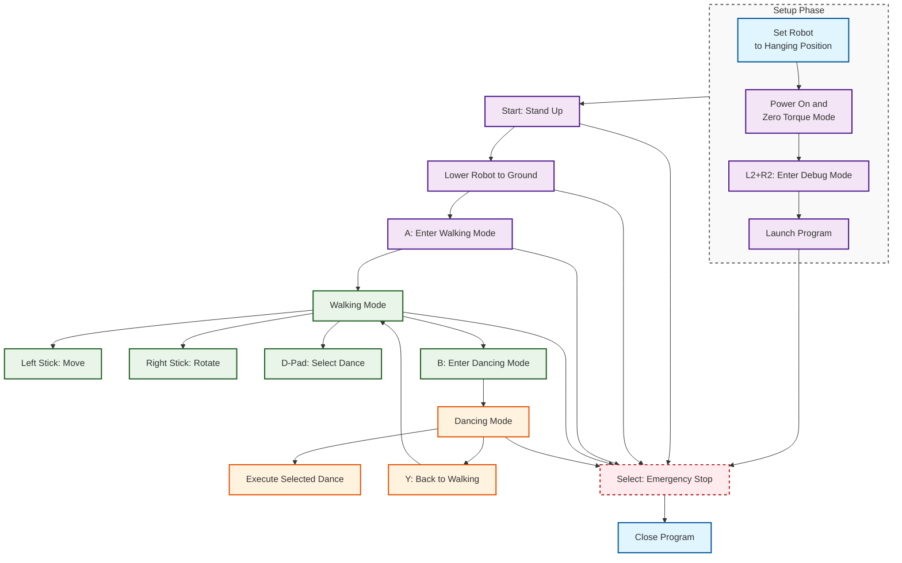

# HoloMotion Deployment Guide

This guide describes how to set up the deployment environment and run the trained policy on a physical Unitree G1 robot.


## Robot Configuration for 29 DOF

The 29 DOF configuration includes:
- 12 leg joints (6 per leg)
- 3 waist joints (yaw, roll, pitch) 
- 14 arm joints (7 per arm) 

---
### Quick Environment Setup

#### Prerequisites

Ensure the following are installed before proceeding:

* Anaconda or Miniconda
* ROS 2 Humble installed at `/opt/ros/humble`
* MCAP for efficient ROS 2 data recording
* Unitree ROS 2 SDK installed at `~/unitree_ros2/`


#### One-Click Deployment

```bash
cd holomotion/deployment
chmod +x deploy_environment.sh
./deploy_environment.sh
```

This script will:

* Create a new conda environment (with CUDA support if available)
* Install Python packages from `requirements/requirements_deploy.txt`
* Install Unitree SDK Python bindings
* Build the ROS 2 workspace under `unitree_g1_ros2_29dof/`

---

## Deploy on Physical G1 Robot

### ⚠️ Important Safety Notice

> **For safety reasons, it is strongly recommended to remove the dexterous hands before running the policy.**


### Setup Overview

The deployment process consists of two types of steps:

| **One-Time Setup** (per computer) | **Every Run** (each time you use the robot) |
|-----------------------------------|----------------------------------------------|
| Step 1: Network Configuration    | Step 3: Power On & Initialize Robot         |
| Step 2: Launch Script Setup      | Step 4: Launch Policy Controller            |

> **Note**: Once you complete Steps 1-2, you only need to do Steps 3-4 for each robot session!

### Step 1: Connect and Configure Network

> **Important**: This step only needs to be done **ONCE per computer**. Once configured, your network settings will be saved for future use.

#### Prerequisites for Network Setup:
1. **Power on the robot** and wait for it to fully boot
2. **Use an Ethernet cable** to connect your PC to the robot's LAN port
3. **Ensure both devices are powered on** during configuration

#### Network Configuration:

Configure your PC's network interface with the following static IP settings:

* **Static IP**: `192.168.123.222`
* **Netmask**: `255.255.255.0`
* **Gateway**: (leave empty)

#### Automatic Configuration Script:

You can use the following script to configure it automatically (use command `nmcli con show` to check your actual connection name):

<details>
<summary>Click to view set_static_ip.sh</summary>

```bash
#!/bin/bash

# Replace with your actual connection name (use `nmcli con show` to check)
CON_NAME="Wired connection 1"
IP_ADDRESS="192.168.123.222"
NETMASK="24"
GATEWAY=""

nmcli con modify "$CON_NAME" ipv4.addresses "$IP_ADDRESS/$NETMASK"
nmcli con modify "$CON_NAME" ipv4.method manual

if [ -n "$GATEWAY" ]; then
  nmcli con modify "$CON_NAME" ipv4.gateway "$GATEWAY"
fi

nmcli con modify "$CON_NAME" ipv4.dns ""
nmcli con down "$CON_NAME" && nmcli con up "$CON_NAME"
```

</details>

---

### Step 2: Prepare Launch Script

> **Important**: This configuration also only needs to be done **ONCE per computer**. The settings will be saved for future runs.

#### Configure Network Interface:

1. **Check your network interface name** (while connected to the robot):
   ```bash
   ifconfig
   ```
   Look for the interface connected to the robot (e.g., `enxf8e43ba00afd`, `eth0`, `enp0s31f6`)

2. **Update the launch configuration**:
   ```bash
   # Edit the launch file
   nano unitree_g1_ros2_29dof/src/launch/holomotion_29dof_launch.py
   ```
   Find and update the `network_interface` parameter with your actual interface name.

#### Configure Environment Path:

3. **Verify conda environment path** in the launch script:
   ```bash
   # Edit the launch script
   nano unitree_g1_ros2_29dof/launch_holomotion_29dof.sh
   ```
   Make sure the `CONDA_PREFIX` matches your conda environment path (default: `holomotion_deploy`).

4. **Verify Python Environment Configuration**: Check that the `policy_node_29dof.py` uses the correct Python interpreter path:

   ```bash
   # Navigate to the policy node directory
   cd unitree_g1_ros2_29dof/src/humanoid_policy/

   # Check the current shebang line
   head -1 policy_node_29dof.py
   ```

   The first line should point to your `holomotion_deploy` environment:
   ```bash
   #!/your_dir/miniconda3/envs/holomotion_deploy/bin/python
   ```

> **Tip**: After this one-time setup, you can simply run the system without repeating these configuration steps.

---

### Step 3: Power On and Initialize the Robot

> **Do this every time** you want to run the robot.

#### Robot Initialization Sequence for 29 DOF:

1. **Power on the robot** - Start the robot in the **hanging position**
2. **Wait for zero torque mode** - The robot will automatically enter zero torque mode (joints feel loose)
3. **Connect your computer** - Use the same Ethernet cable to connect to the robot's LAN port
4. **Enter debugging mode (Optional, recommended)** - On the remote controller, press `L2 + R2` simultaneously. Note: the new deployment automatically enters this mode on startup, so manual entry is usually not required.


---


### Step 4: Launch the Policy Controller

#### Step 4 Preflight Checklist

Before running, ensure the following are ready. 

- Model folders configured in `g1_29dof_holomotion.yaml` exist
  - `motion_tracking_model_folder`: under `src/models/`
  - `velocity_tracking_model_folder`: under `src/models/`
- Motion data directory exists and contains .npz files (retargeted results)
  - `dance_motions_dir`: under `src/motion_data/`
- Config file path used by launch is correct


#### One-click start

```bash
cd holomotion/deployment/unitree_g1_ros2_29dof
bash launch_holomotion_29dof.sh
```

> **Success indicator**: On startup, the robot joints should remain in zero torque state and feel free to move.


#### Motion Control Modes

The 29 DOF robot operates in two main modes:

| Mode | How to Enter | Controls | Switch |
|------|--------------|----------|--------|
| Walking | 1) Press Start to stand up, then press A<br/>2) From dancing: press Y | Left stick: move (vx, vy)<br/>Right stick: rotate (yaw)<br/>D-Pad: select dance (Left=first, Right=last, Up=prev, Down=next) | B: enter dancing |
| Dancing | Press B | Executes selected dance automatically | Y: back to walking |

#### Control Flow

Here is the robot control flowchart for 29 DOF:



#### Configuration Files (used by Step 4)

**System Configuration**
- File: `holomotion/deployment/unitree_g1_ros2_29dof/src/config/g1_29dof_holomotion.yaml`
- Key parameters:
  - `motion_tracking_model_folder`: dance model folder under `models/`
  - `velocity_tracking_model_folder`: walking model folder under `models/`
  - `dance_motions_dir`: dance motion data folder under `src/`


**Adding New Dance Models**
1. Create a new folder under `models/` based on the following example model folder structure (e.g., `models/your_model_dir_name/`) 
2.  Update `motion_tracking_model_folder` in the config file
3. Ensure the dance motion data files are in the `dance_motions_dir`

Example model folder structure (motion model):

```bash
holomotion/deployment/unitree_g1_ros2_29dof/src/models/your_model_dir_name
├── config.yaml
├── exported
    └── your_model_name.onnx
```

---

### Safety Notice

This deployment is intended for demonstration only. It is not a production-grade control system. Do not interfere with the robot during operation. If unexpected behavior occurs, exit control immediately via the controller or keyboard to ensure safety.

To stop the control process, press `Select` or use `Ctrl+C` in the terminal.
