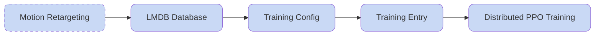

## Train the Motion Tracking Model

After completing motion retargeting, you can train a motion tracking model with HoloMotion using the following process.

**Overall Workflow:**



### 1. Pack the LMDB Training Dataset

For efficient distributed training, HoloMotion uses the [LMDB](https://www.symas.com/mdb) database, which provides high-performance memory-mapped data loading.

Assuming your retargeted motion files are saved in `data/retargeted_datasets/g1_21dof_test`, modify the database packing script at `holomotion/scripts/training/pack_lmdb_database.sh`:

```shell
source train.env
export CUDA_VISIBLE_DEVICES=""

retargeted_pkl_path="data/retargeted_datasets/g1_21dof_test"
dump_dir="data/lmdb_datasets/lmdb_g1_21dof_test"
robot_config="unitree/G1/21dof/21dof_training"

${Train_CONDA_PREFIX}/bin/python \
    holomotion/src/training/pack_lmdb.py \
    robot=$robot_config \
    retargeted_pkl_path=$retargeted_pkl_path \
    lmdb_save_dir=$dump_dir \
    num_jobs=4
```

Ensure the input/output paths are correct and the robot config matches your requirements. Then run:

```shell
bash holomotion/scripts/training/pack_lmdb_database.sh
```

The LMDB database will be created at the specified `dump_dir`.

### 2. Train the Motion Tracking Model

The training entry point is `holomotion/src/training/train_motion_tracking.py`, which uses the training config to start distributed training across multiple GPUs.

#### 2.1 Prepare the Training Config

Use the demo config at `holomotion/config/training/motion_tracking/exp_unitree_g1_21dof_teacher.yaml` as a template. Key configuration groups to modify (configs are located in the `holomotion/config/` directory):

- **`/algo`**: Algorithm settings (PPO/Dagger/AMP) and network configurations
- **`/robot`**: Robot-specific config including DOF, body links, and control parameters
- **`/env`**: Environment settings including motion sampling and curriculum learning
- **`/env/observations`**: Observation dimensions, noise, and scaling for the policy
- **`/env/rewards`**: Reward function definitions
- **`/env/domain_randomization`**: Domain randomization settings (start with `NO_domain_rand`)
- **`/env/terrain`**: Terrain configuration (start with `plane` for flat terrain)

```yaml
# @package _global_

defaults:
  - /training: train_base
  - /simulator: isaacgym
  - /algo: ppo
  - /robot: unitree/G1/21dof/21dof_training
  - /env: motion_tracking
  - /env/observations: motion_tracking/obs_ppo_teacher
  - /env/rewards: motion_tracking/relative_tracking
  - /env/domain_randomization: NO_domain_rand
  - /env/terrain: plane

project_name: HoloMotion
```

#### 2.2 Prepare the Training Script for Teacher

Review and modify the training script at `holomotion/scripts/training/train_motion_tracking_teacher.sh`. Ensure `config_name` and `motion_file` match your training config and LMDB database directory.

```shell
source train.env
export CUDA_VISIBLE_DEVICES="0"

config_name="exp_unitree_g1_21dof_teacher"
motion_file="data/lmdb_datasets/lmdb_g1_21dof_test"
num_envs=2048

${Train_CONDA_PREFIX}/bin/accelerate launch \
    --multi_gpu \
    --mixed_precision=bf16 \
    holomotion/src/training/train_motion_tracking.py \
    --config-name=training/motion_tracking/${config_name} \
    use_accelerate=True \
    num_envs=${num_envs} \
    headless=True \
    experiment_name=${config_name} \
    motion_lmdb_path=${motion_file}
```

Start training by running:

```shell
bash holomotion/scripts/training/train_motion_tracking_teacher.sh
```

#### 2.3 Prepare the Training Script for Student

The above step lets you train a teacher policy with access to priveliged information in the simulator. But to obtain a deployable policy in the realworld, you need to perform policy distillation through the DAgger process, which is essentially online imiation learining with a querable expert (our teacher policy).

To start the studnet training, you should specify the studnet training config name as well as the pretrained teacher policy ckpt path:

```shell
source train.env
export CUDA_VISIBLE_DEVICES="0"

config_name="train_unitree_g1_21dof_student"
teacher_ckpt_path="logs/HoloMotion/xxxxxxxx_xxxxxx-train_unitree_g1_21dof_teacher/model_x.pt"
motion_file="data/lmdb_datasets/lmdb_g1_21dof_test"
num_envs=16

${Train_CONDA_PREFIX}/bin/accelerate launch \
    --multi_gpu \
    --mixed_precision=bf16 \
    --main_process_port=29501 \
    holomotion/src/training/train_motion_tracking.py \
    --config-name=training/motion_tracking/${config_name} \
    use_accelerate=true \
    num_envs=${num_envs} \
    headless=true \
    experiment_name=${config_name} \
    motion_lmdb_path=${motion_file} \
    algo.algo.config.teacher_actor_ckpt_path=${teacher_ckpt_path}
```

Start training by running:

```shell
bash holomotion/scripts/training/train_motion_tracking_student.sh
```


### Training Tips

#### How to use less GPU ?

Training requires significant GPU memory. Reduce `num_envs` if your GPU has limited GRAM. This will reduce both the rollout burden and the PPO training consumption, at the risk of significantly less stable policy optimization process.

Another way to reduce GRAM usage, is to explicity set the `num_mini_batches` to a higher number, which will result in smaller batches to be used by the PPO policy optimization stage. To add this option to your training entry, just set `algo.algo.config.num_mini_batches=X` in the bash script.

#### How to start multiple training session ?

In cases where you would like to start multiple training sessions, you should explicitly add the `--main_process_port=port_number` option in the training entry bash script to avoid port conflict of the accelerate backend. And this `port_number` **can not** be `0` .

If you would like to run training on a specific GPU, just modify the GPU id in the `export CUDA_VISIBLE_DEVICES="X"` statement.

#### How to set the save/log intervals ?

You may want to have more or less frequent logging and model dumping intervals. You can alter these intervals by adding the following options:

- `algo.algo.config.save_interval=X` : The checkpoint will be saved every `X` learning iterations.
- `algo.algo.config.log_interval=Y`: The logging information will be displayed every `Y` learning iterations.

#### Where is the checkpoint dumped ?

By default, the model checkpoint will be dumped into a folder named `logs/HoloMotion`. You can change this path by explictly setting `project_name=X`, which results in dumping the checkpoints into the `logs/X` directory.

#### How to resume training from a checkpoint ?

To resume training from a pretrained checkpoint, you can find the checkpoint in the log directory, and then add the option like this: `checkpoint=logs/HoloMotion/20250728_214414-train_unitree_g1_21dof_teacher/model_X.pt`
