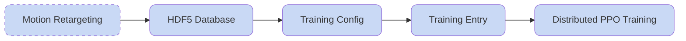

## Train the Motion Tracking Model

After completing motion retargeting, you can train a motion tracking model with HoloMotion using the following process.

**Overall Workflow:**


```mermaid
flowchart LR
A[Motion Retargeting] --> B[HDF5 Database]
B --> C[Training Config]
C --> D[Training Entry]
D --> E[Distributed PPO Training]

classDef dashed stroke-dasharray: 5 5, rx:10, ry:10, fill:#c9d9f5
classDef normal fill:#c9d9f5, rx:10, ry:10
class A dashed
class B,C,D,E normal
```

### 1. Train the Motion Tracking Model

The training entry point is `holomotion/src/training/train.py`, which uses the training config to start distributed training across multiple GPUs.

#### 1.1 Prepare the Training Config

Use `holomotion/config/training/motion_tracking/motion_tracking_v1_4_0.yaml` as the v1.4.0 template. Key configuration groups to modify are located under `holomotion/config/`:

- **`/algo`**: Algorithm settings (PPO) and network configurations
- **`/robot`**: Robot-specific config including DOF, body links, and control parameters
- **`/env`**: Environment settings including motion sampling and curriculum learning
- **`/env/observations`**: Observation dimensions, noise, and scaling for the policy
- **`/env/rewards`**: Reward function definitions
- **`/env/domain_randomization`**: Domain randomization settings (start with `NO_domain_rand`)
- **`/env/terrain`**: Terrain configuration
- **`/modules`**: The policy network modules definitions

```yaml
# @package _global_

defaults:
  - /training: train_base
  - /algo: ppo_tf
  - /robot: unitree/G1/29dof/29dof_training_isaaclab
  - /env: motion_tracking
  - /env/terminations: termination_motion_tracking
  - /env/observations: motion_tracking/obs_motion_tracking_tf-moe
  - /env/rewards: motion_tracking/rew_motion_tracking
  - /env/domain_randomization: domain_rand_medium
  - /env/terrain: isaaclab_rough
  - /modules: motion_tracking/motion_tracking_tf-moe
  - _self_

project_name: HoloMotionMotrackV1.4

train_hdf5_roots:
  - { root: data/h5v2_datasets/AMASS_test, ratio: 1.0 }
```

Replace the example HDF5 root with the robot HDF5 output generated by HoloRetarget. Multiple roots can be assigned different sampling ratios.

#### 1.2 Train your Policy

The training script defaults to `motion_tracking_v1_4_0.yaml`. Set `CONFIG_NAME` to select another config and `NUM_ENVS` to override the number of environments. Verify that `train_hdf5_roots` in the selected config points to the robot HDF5 dataset.

Start training by running:

```shell
bash holomotion/scripts/training/train_motion_tracking.sh

# Example override
NUM_ENVS=2048 CONFIG_NAME=motion_tracking_v1_4_0 \
  bash holomotion/scripts/training/train_motion_tracking.sh
```

Note that IsaacLab relies on internet connections to pull assets from Nvidia's cloud storage. If you encountered stuck at scene creation, it is very likely that you can't access the cloud-hosted assets. Turn on your proxy and try again can solve the issue.

### Training Tips

#### How to use less GPU ?

Training requires significant GPU memory. Reduce `NUM_ENVS` if GPU memory is limited. This reduces both rollout and PPO memory consumption, but may make policy optimization less stable.

#### How to start multiple training session ?

In cases where you would like to start multiple training sessions, you should explicitly add the `--main_process_port=port_number` option in the training entry bash script to avoid port conflict of the accelerate backend. And this `port_number` **can not** be `0` .

If you would like to run training on a specific GPU, just modify the GPU id in the `export CUDA_VISIBLE_DEVICES="X"` statement.

#### How to set the save/log intervals ?

You may want to have more or less frequent logging and model dumping intervals. You can alter these intervals by adding the following options:

- `algo.config.save_interval=X` : The checkpoint will be saved every `X` learning iterations.
- `algo.config.log_interval=Y`: The logging information will be displayed every `Y` learning iterations.

#### Where is the checkpoint dumped ?

By default, checkpoints are written to `logs/<project_name>/<timestamp>-<experiment_name>/`. Change `base_dir`, `project_name`, or `experiment_name` to customize this path.

#### How to resume training from a checkpoint ?

To resume training, pass the checkpoint path as a Hydra override, for example: `checkpoint=logs/<project_name>/<timestamp>-<experiment_name>/model_X.pt`.
