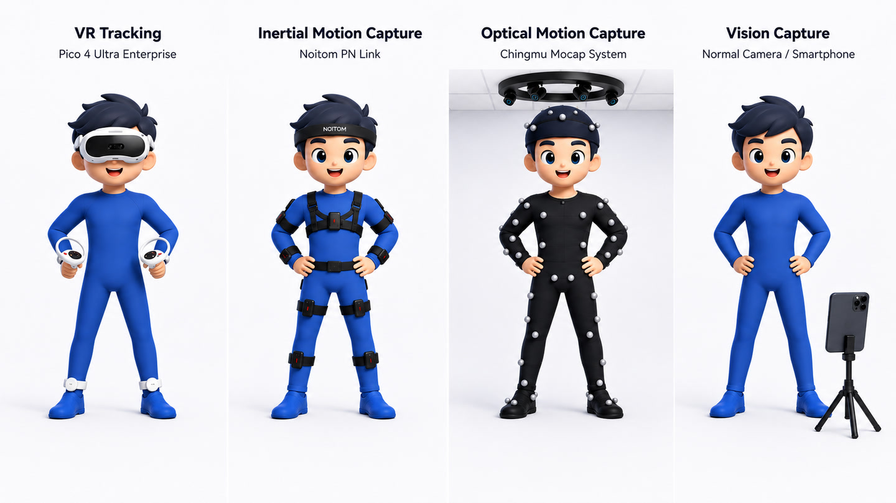

# HoloSMPL

HoloSMPL converts human motion sources into the project-standard human-side
representation used before HoloRetarget robot data production.

The normal production flow is:

```text
raw dataset or device export -> HoloSMPL NPZ/H5 -> HoloRetarget robot H5
```

Supported device sources span VR, inertial, optical, and GVHMR-based vision
capture.

<p align="center">
  
</p>

Most users only need the source list and one conversion command:

```bash
python -m holosmpl list-sources

python -m holosmpl convert \
  --source pico4_ultra_enterprise \
  --input-root /path/to/raw_pico_csv_root \
  --output-root /path/to/holosmpl_output \
  --overwrite
```

The `convert` entry point always writes the project-standard 50Hz format.

## Output Layout

The output root contains:

```text
canonical/    # canonical SMPL/SMPL-like NPZ clips
formal_npz/   # formal HoloSMPL NPZ clips
formal_h5/    # packed HoloSMPL H5 shards, unless --skip-h5 is set
reports/      # validation reports
run_configs/  # exact run configs for reproducibility
```

## Visual Checks

After conversion, generate quick visual checks from the produced motion files:

```bash
python -m holosmpl visualize-canonical \
  --canonical-root /path/to/holosmpl_output/canonical \
  --output-root /path/to/visual_check \
  --smpl-models-root /path/to/holomotion/assets

python -m holosmpl render-canonical-video \
  --canonical-root /path/to/holosmpl_output/canonical \
  --output-root /path/to/canonical_video_check \
  --smpl-models-root /path/to/holomotion/assets

python -m holosmpl render-formal-video \
  --formal-root /path/to/holosmpl_output/formal_npz \
  --output-root /path/to/formal_video_check \
  --smpl-models-root /path/to/holomotion/assets
```

`visualize-canonical` writes sampled contact sheets and geometry summaries.
`render-canonical-video` and `render-formal-video` write MP4 previews plus JSON
and Markdown render reports. These commands are validation utilities; production
conversion does not require them.

## Data Format

HoloSMPL uses two human-side stages.

Canonical clips keep source-normalized SMPL or SMPL-like arrays:

```text
root_orient: [T, 3]
pose_body:   [T, 63] or [T, 69]
trans:       [T, 3]
betas:       [B]
metadata:    JSON string
```

`pose_body` layout is recorded in metadata. The world frame is canonical Z-up,
meter-scale.

Formal clips are the stable interface for training-data production:

```text
human_pose_aa:             [T, 72]
human_root_trans:          [T, 3]
human_shape_beta:          [B]
human_root_height:         [T, 1]
human_gravity_projection:  [T, 3]
metadata:                  JSON string
```

## Code Layout

- `supported_datasets/`: public or dataset-style source READMEs and registry.
- `supported_devices/`: capture-system and hardware-export source READMEs and
  registry. Camera/video reconstruction lives under `supported_devices/camera/`;
  GVHMR is one supported camera method.
- `sources.py`: supported source list and dispatch.
- `converters/`: raw format readers and source-specific conversion logic.
- `core/`: shared schema, metadata, processing, validation, IO, writers, and
  source-independent utilities.
- `workflows/`: end-to-end and step-level data production flows.
- `visualization/`: visual check entry points and rendering helpers.

Most users should start from the source-specific README under
`supported_datasets/<name>/` or `supported_devices/<name>/`.

For monocular video input, use the optional
[`supported_devices/camera`](supported_devices/camera/README.md) workflow to run
GVHMR first, then convert the generated SMPL NPZ files with HoloSMPL. GVHMR has
its own environment and is not required for normal dataset or device exports.

## Adding a Source

Add user-facing notes under one of:

```text
holosmpl/supported_datasets/<source_name>/README.md
holosmpl/supported_devices/<source_name>/README.md
```

Use `datasets` for public datasets and dataset-style releases. Use `devices`
for capture systems, hardware streams, or camera/video reconstruction outputs.

Put parsing and conversion code under `holosmpl/converters/`, then
register the source in either `holosmpl/supported_datasets/registry.py`
or `holosmpl/supported_devices/registry.py`:

```python
SOURCE_CONFIGS["my_source"] = {
    "source_name": "MySource",
    "source_glob": "*.npz",
    "classify": classify_source,
    "convert": convert_sample,
    "convertible_status": "convertible_motion_npz",
}
```

For packed sources that expand one raw file into many clips, export
`iter_convert` and set `multi_clip_source`. Finally, add the source spec in
`holosmpl/sources.py` and verify:

```bash
python -m holosmpl list-sources
python -m holosmpl convert --source my_source --input-root RAW --output-root OUT --skip-h5
```
